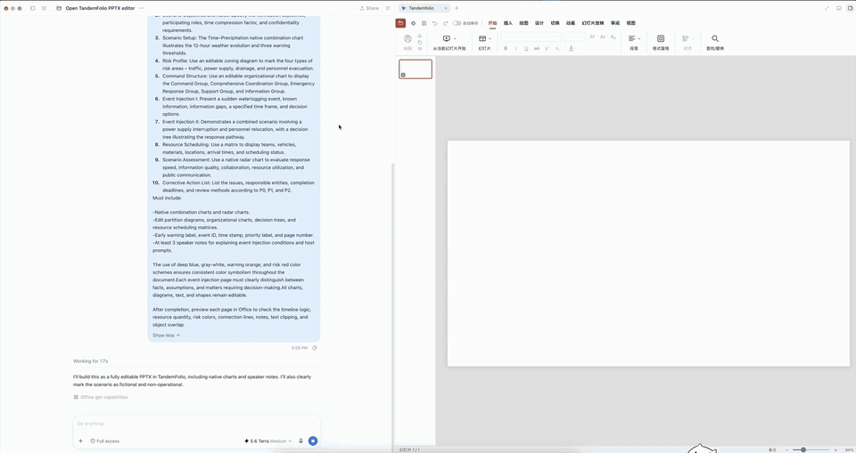

# TandemFolio

> A local-first visual workspace where you and your agent edit the same document.

[中文说明](README.zh-CN.md) · [Documentation](docs/README.md) · [Getting started](docs/getting-started.md)

TandemFolio brings persistent visual editing to MCP Apps hosts such as Codex. Open a document in a familiar, format-native editor; then let an agent work on the very same file, selection, undo history, and revision you see on screen.

It is designed for people who want agent assistance without handing a document to a separate, opaque file-generation workflow. Files stay local, editing remains visible, and every agent mutation is routed through the mounted editor.

## Demo

This preview shows Codex opening TandemFolio's PPTX editor and building a 10-slide, fully editable presentation in the same task. Click it to watch the complete 49-second recording.

[](docs/assets/tandemfolio-demo.mp4)

[Watch or download the full MP4 demo](docs/assets/tandemfolio-demo.mp4)

## What it solves

- **One document, two collaborators.** Human input and agent operations share the same live editor state instead of maintaining competing copies.
- **Visual, local-first editing.** Work directly with local DOCX, XLSX, PPTX, PDF, and Markdown files in an MCP Apps host.
- **Predictable agent changes.** Typed operations are revision-aware and use the editor's own state and undo routes.
- **No product account or cloud document service.** The packaged product is a browser-based local editor and MCP server.

## Formats

| Format | Visual editor | Typical work |
| --- | --- | --- |
| DOCX | Word-processing canvas | Text, layout, tables, comments, images |
| XLSX | Spreadsheet canvas | Cells, formulas, sheets, charts |
| PPTX | Slide canvas | Slides, text, layouts, objects |
| PDF | PDF workspace | Text, annotations, forms, pages |
| Markdown | Rich-text Markdown editor | Writing, structure, frontmatter, export |

## Quick start

From a source checkout, install dependencies and start the local MCP server with one command:

```bash
npm install --ignore-scripts && npm run dev
```

Requirements: Node.js 22.12+ and npm 10+. To create the self-contained local plugin package, run `npm run build`; see [Getting started](docs/getting-started.md) for host installation and standalone-editor workflows.

## How a session works

1. Open a TandemFolio editor in an MCP Apps host.
2. The host keeps one live editor session mounted for the document.
3. Ask the agent to inspect or change the document.
4. The agent's typed operation reaches that same mounted editor, which updates the visible document and its undo history.

If the editor is closed, mutations fail rather than silently changing a hidden copy.

## Project status

TandemFolio is pre-release software. All five format editors are packaged, but release readiness is deliberately fail-closed until the current source passes the complete visual, performance, smoke, license, and repository evidence gate. See [project facts](docs/project-facts.md) for the precise status and provenance.

## Documentation

- [Getting started](docs/getting-started.md) — run from source, build the plugin, and open it in a host.
- [Project facts and attribution](docs/project-facts.md) — provenance, Apache-2.0 obligations, and modification records.
- [Live-session protocol](docs/protocol/live-session.md) — implemented session, tool, revision, and persistence behavior.
- [Development guide](docs/development.md) — build, test, packaging, release, and troubleshooting.
- [Architecture decisions](docs/adr/) — accepted technical decisions.

## Contributing

Contributions are welcome. Start with [CONTRIBUTING.md](CONTRIBUTING.md), then read the [project facts](docs/project-facts.md) before changing upstream-derived code.

## License and attribution

TandemFolio is distributed under the [Apache License 2.0](LICENSE). It includes and modifies Apache-2.0 community code; original copyright notices, the license text, and the project's [NOTICE](NOTICE) are retained. The complete source and modification record is in [Project facts and attribution](docs/project-facts.md).
